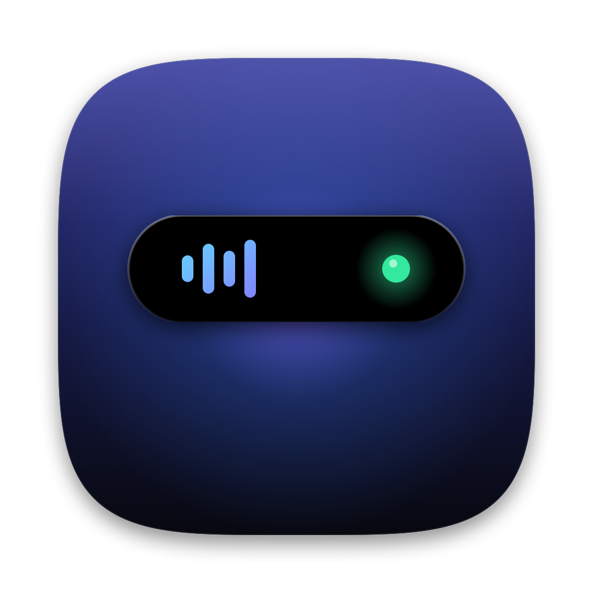

<p align="center">
  
</p>

<h1 align="center">DynIsl</h1>

<p align="center">MacBook çentiği için Dynamic Island tarzı bir ada ve bir sistem paneli.</p>

<p align="center"><em>A Dynamic Island–style companion for the MacBook notch, plus a system dashboard. Native Swift / SwiftUI, runs fully on-device.</em></p>

---

## Özellikler

### Ada
- **Müzik:** Spotify ve Apple Music için kapak, ilerleme çubuğu, oynat/duraklat/geç, ses, karışık çal, tekrar; Apple Music'te favori ve "sevmedim". Şarkı değişimlerinde yumuşak geçişler, kapak renginde parıltı.
- **Ses ve parlaklık göstergesi:** macOS'un göstergesinin yerine adada kendi göstergesi (isteğe bağlı); her basışta %2, %5 ya da %10 adım.
- **Canlı bildirimler:** şarj ve pil, AirPods bağlanması ve pil uyarısı, takvim toplantıları, Odak modu, kamera/mikrofon kullanımı, indirme ilerlemesi, ekran görüntüsü önizlemesi, internet koptu / geri geldi, yağmur uyarısı, sistem uyarıları.
- **Görüşme modu:** kamera ya da mikrofon açıkken görüşme süresi ve sistem genelinde mikrofonu kapatma.
- **Sekmeler:** müzik, takvim, raf ve AirDrop, pano geçmişi, sistem kullanımı, pil analizi.
- **Zamanlayıcı** ve `island` terminal komutuyla kendi bildirimlerin.

### Sistem Paneli
- İşlemci (çekirdek bazında), grafik işlemcisi, bellek, depolama, ağ ve Wi-Fi, pil sağlığı, ekranlar, Bluetooth cihazları, işlemler.
- İnternet hız testi (macOS'un yerleşik `networkQuality` aracıyla).
- Masaüstü düzenleme: masaüstündeki dosyaları türüne ve ayına göre klasörlere taşır, geri alınabilir.
- İndirilenler temizliği: uzun süredir açılmamış kurulum dosyalarını, arşivleri ve diğer indirmeleri boyutuyla listeler; seçtiklerini Çöp Sepeti'ne taşır, geri alınabilir.

### Menü çubuğu
- Canlı CPU ve RAM kullanımı.
- Uyanık tut: Mac'in uykuya girmesini süresiz ya da 30 dk – 4 saat boyunca engeller.

## Gereksinimler

- macOS 14 Sonoma ya da daha yeni
- Xcode ya da Xcode Command Line Tools (Swift 5.9+)
- Çentikli MacBook önerilir; çentiksiz ekranlarda ada menü çubuğunun ortasında durur.

## Kurulum

```bash
git clone https://github.com/caganerdal/DynIsl.git
cd DynIsl
./build-app.sh install
```

`build-app.sh` uygulamayı derler, `build/DynIsl.app` paketini oluşturur ve `install` ile `/Applications` klasörüne kurar. Anahtar zincirinde bir **Apple Development** sertifikası varsa onunla, yoksa geçici (ad-hoc) imzayla imzalar. Geçici imzada macOS izinleri her yeniden derlemeden sonra tekrar sorulabilir.

Sadece derlemek için:

```bash
./build-app.sh
```

Uygulama simgesini yeniden üretmek için:

```bash
./Tools/make-icon.sh
```

## İzinler

Her izin isteğe bağlıdır; verilmezse ilgili özellik çalışmaz, geri kalanı etkilenmez.

| İzin | Ne için |
|---|---|
| Otomasyon (Spotify, Müzik) | Çalan şarkıyı göstermek ve kontrol etmek |
| Takvim | Yaklaşan toplantılar |
| Konum | Hava durumu (konum yaklaşık 1 km'ye yuvarlanır) |
| Bluetooth | AirPods bağlantı ve pil bildirimleri |
| Erişilebilirlik | Ses ve parlaklık tuşlarını yakalayıp kendi göstergesini göstermek (sadece medya/parlaklık tuşlarını dinler) |
| Tam Disk Erişimi | Etkin Odak modunu okumak (macOS bu bilgiyi korumalı bir klasörde tutuyor) |

## Terminal komutu

Kurulumla birlikte `~/.local/bin/island` komutu eklenir. Bu klasör `PATH`'inizde değilse `~/.zshrc` dosyasına `export PATH="$HOME/.local/bin:$PATH"` satırını ekleyin.

```bash
island "Build bitti"
island -s "Testler geçti"
island -e "Deploy başarısız"
island run npm test
```

## Gizlilik

- Her şey bilgisayarda çalışır; analiz, ölçüm ve kayıtlar cihazdan çıkmaz.
- İnternete yalnızca şu durumlarda bağlanılır: hava durumu ([Open-Meteo](https://open-meteo.com), yuvarlanmış konumla), Spotify kapak görseli ve kullanıcı başlattığında hız testi (Apple sunucuları).
- Pano geçmişi yalnızca bellekte tutulur, şifre yöneticilerinden gelen kopyalar kaydedilmez, ekran kilitlenince silinir.
- Ada, ekran paylaşımı ve kayıtlarda varsayılan olarak gizlenir.

## Notlar

- Parlaklık kontrolü için macOS'un genel olmayan `DisplayServices` çerçevesi çalışma anında yüklenir; bu nedenle uygulama App Store'a uygun değildir.
- Uygulama sıkılaştırılmış çalışma zamanı (hardened runtime) ile imzalanır.

## Lisans

Tüm hakları saklıdır. Kaynak kod incelemeye açıktır; kullanmak, değiştirmek ya da dağıtmak için izin gerekir.

---

Apple, Mac, MacBook, macOS ve Dynamic Island, Apple Inc.'in ticari markalarıdır. Bu proje Apple ile ilişkili değildir ve Apple tarafından desteklenmemektedir. Spotify, Spotify AB'nin ticari markasıdır.
